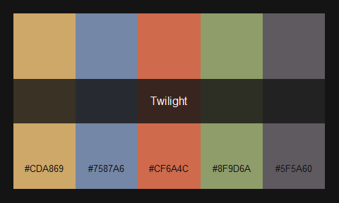
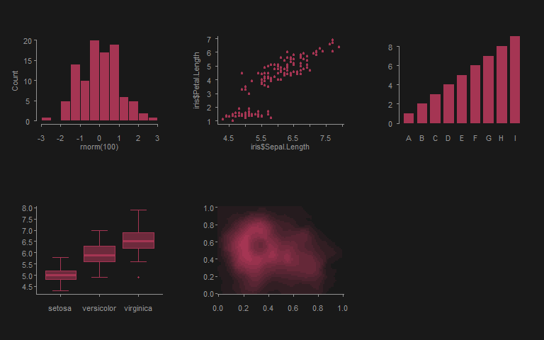
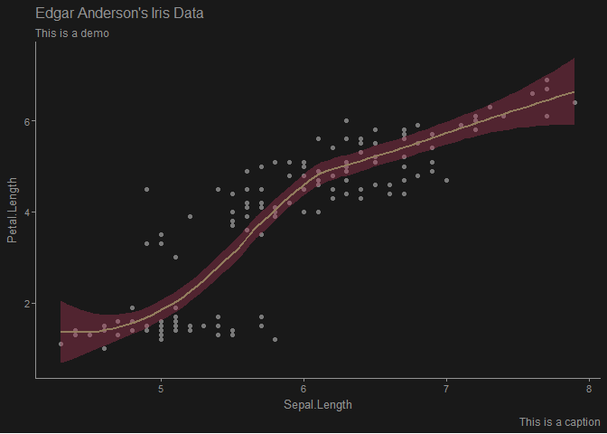
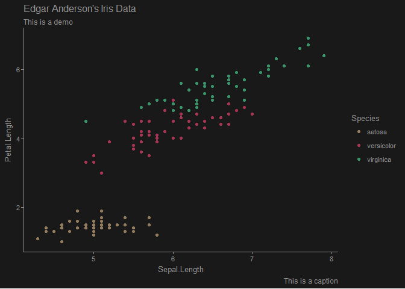

<!-- README.md is generated from README.Rmd. Please edit that file -->
[](https://travis-ci.org/fkeck/editheme)

editheme
========

### Palettes and graphics matching your RStudio editor

The package editheme provides a collection of color palettes designed to match the different themes available in RStudio. It also includes functions to customize 'base' and 'ggplot2' graphs styles in order to harmonize the look of your favorite IDE.

### Install

To install the package from Gihub you can use devtools:

``` r
devtools::install_github("fkeck/editheme")
```

``` r
library(default)
library(editheme)
```

### Palettes

Print the list of available palettes with list\_pal:

``` r
list_pal()
#>  [1] "Ambiance"              "Chaos"                
#>  [3] "Chrome"                "Clouds"               
#>  [5] "Clouds Midnight"       "Cobalt"               
#>  [7] "Crimson Editor"        "Dawn"                 
#>  [9] "Dracula"               "Dreamweaver"          
#> [11] "Eclipse"               "Idle Fingers"         
#> [13] "Katzenmilch"           "Kr Theme"             
#> [15] "Material"              "Merbivore"            
#> [17] "Merbivore Soft"        "Mono Industrial"      
#> [19] "Monokai"               "Pastel On Dark"       
#> [21] "Solarized Dark"        "Solarized Light"      
#> [23] "TextMate"              "Tomorrow"             
#> [25] "Tomorrow Night"        "Tomorrow Night 80s"   
#> [27] "Tomorrow Night Blue"   "Tomorrow Night Bright"
#> [29] "Twilight"              "Vibrant Ink"          
#> [31] "Xcode"
```

Get one specific palette with get\_pal and visualize it with viz\_pal:

``` r
my_pal <- get_pal(theme = "Twilight")
viz_pal(my_pal, print.hex = TRUE)
```



get\_pal is smart, if you are using RStudio, it can find automatically the palette matching your current theme using rstudioapi, just type:

``` r
get_pal()
```

[All available palettes](man/figures/viz_all_pal.png)

### Customizing base graphics

To change the look of base graphics editheme uses the styles package. The function set\_base\_sty modifies the graphical parameters and the behavior of different generic plotting functions according to the selected theme.

``` r
set_base_sty("Clouds Midnight")
par(mfrow = c(2, 3))
hist(rnorm(100))
plot(iris$Sepal.Length, iris$Petal.Length)
barplot(1:9, names.arg = LETTERS[1:9])
boxplot(iris$Sepal.Length ~ iris$Species)
image(volcano)
contour(volcano)
```



### Customizing ggplot2 graphics

The package provides a ggplot2 theme function theme\_editor and scales functions (scale\_color\_editor, scale\_fill\_editor) to control the appearance of the plot.

``` r
library(ggplot2)
pal <- get_pal(theme = "Clouds Midnight")

ggplot(iris, aes(Sepal.Length, Petal.Length)) +
  geom_point(color = col_fg("Clouds Midnight", fade = 0.2)) +
  geom_smooth(color = pal[1],
              fill = pal[2]) +
  labs(title = "Edgar Anderson's Iris Data",
    subtitle = "This is a demo", caption = "This is a caption") +
  theme_editor("Clouds Midnight")
#> `geom_smooth()` using method = 'loess'
```



``` r

ggplot(iris, aes(Sepal.Length, Petal.Length, color = Species)) +
  geom_point() +
  labs(title = "Edgar Anderson's Iris Data",
    subtitle = "This is a demo", caption = "This is a caption") +
  theme_editor("Clouds Midnight") +
  scale_color_editor("Clouds Midnight")
```


